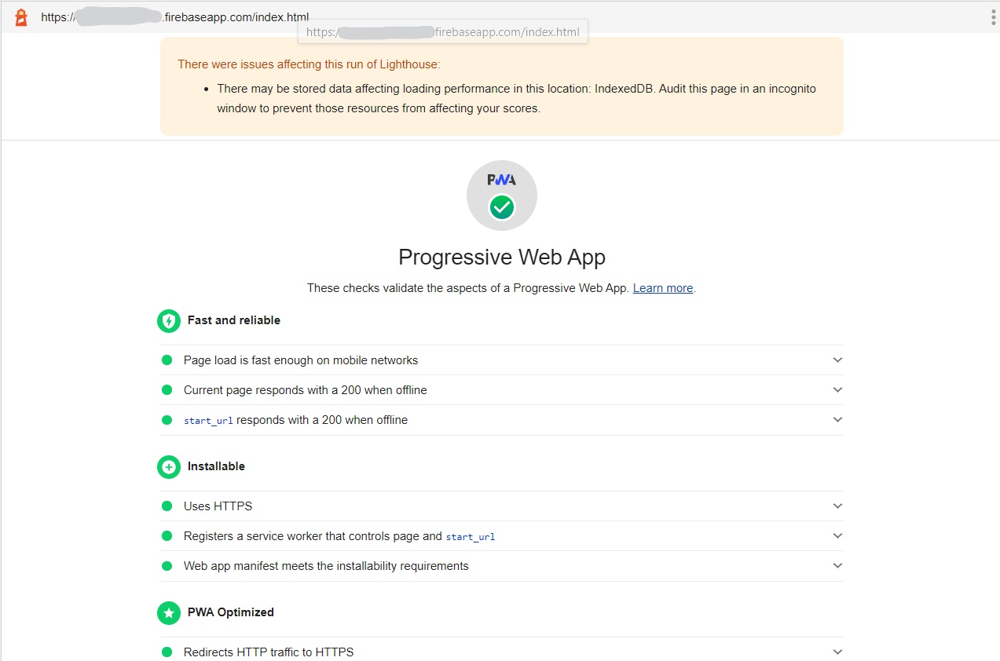
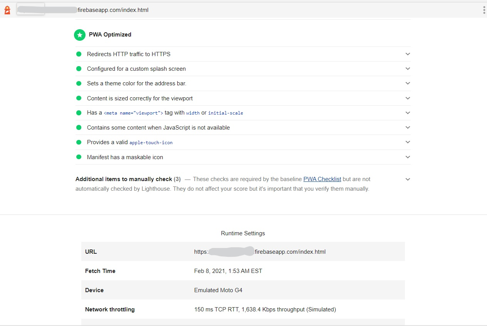
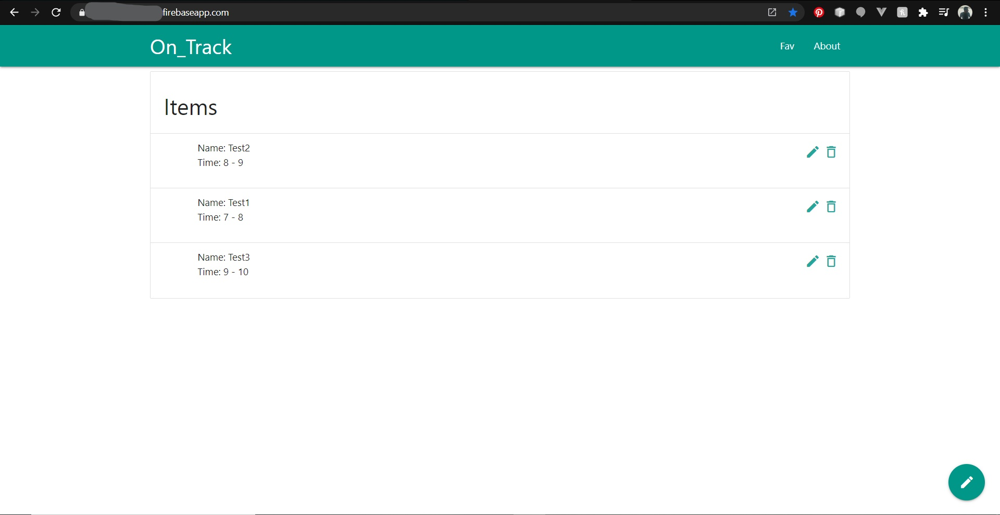
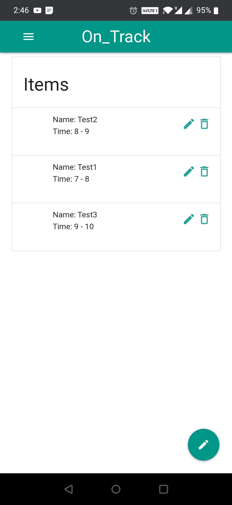
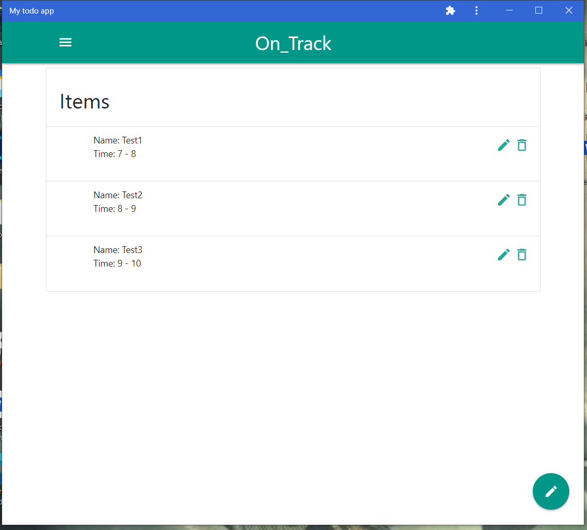

# On_Track

A basic Progressive Web Application using Vanilla JS and Firebase to record events and keep on schedule.

-> Cross_Platform
-> Cloud data storage
-> Hosted on Firebase

Passed Lighthouse report

Works well on Web, Laptop and Mobile

Lighthouse Report:

Web:

Mobile:

Desktop:

